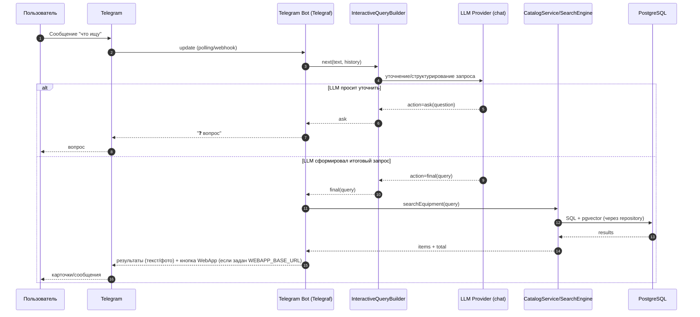
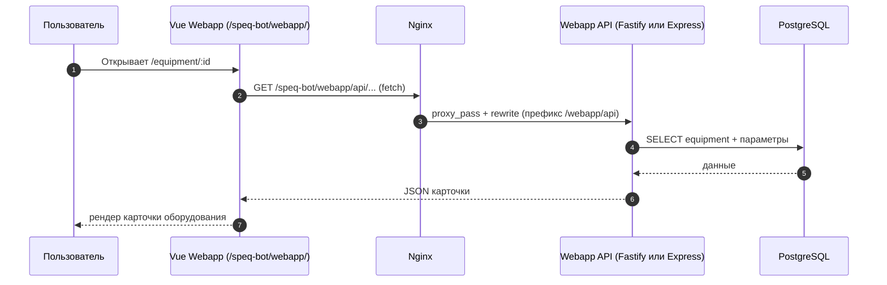

# 42 — Графическая схема проекта (Mermaid)

Ниже — **единая “схема проекта”** в нескольких разрезах: контейнеры/сервисы и основные потоки данных.

## 1) Контейнерная схема (что есть в системе)

```mermaid
flowchart LR
  %% --- External actors ---
  U[Пользователь] --> TG[Telegram]
  U --> B[Браузер]

  %% --- Edge / proxy ---
  N[Nginx (reverse proxy)] --> HTTP[HTTP API\n`src/http/server.ts`\nпорт: HTTP_PORT (def 3000)]
  N --> FE[Webapp Frontend (Vue/Vite)\n`webapp/frontend`\nbase: /speq-bot/webapp/]
  N --> WAPI[Webapp API (Fastify)\n`webapp/fapi`\nSwagger: /api-docs]
  N --> EAPI[Webapp API (Express, legacy)\n`webapp/api`]

  %% --- Telegram bot runtime ---
  TG -->|polling или webhook| BOT[Telegram Bot\n`src/telegram/index.ts`]
  BOT -->|формирует запрос| LLM[LLM Provider(s)\nGroq/OpenAI/Ollama]
  BOT --> SEARCH[Поиск/Каталог\nCatalogService + SearchEngine]
  BOT -->|кнопка WebApp| FE

  %% --- Core data layer ---
  SEARCH --> REPO[EquipmentRepository]
  REPO --> DB[(PostgreSQL + pgvector)]

  %% --- Webapp data access ---
  WAPI --> DB
  EAPI --> DB

  %% --- Offline worker ---
  WORKER[Embeddings Worker\n`src/worker/embed-equipment.ts`] -->|читает/пишет| DB
  WORKER -->|embeddings()| LLM
```

## 2) Поток “поиск в Telegram” (основной сценарий)



## 3) Поток “открыть карточку из WebApp”



